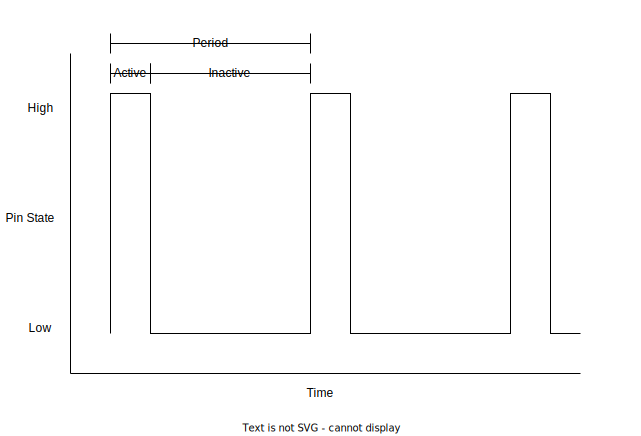

# An Arduino Sound Project

This is a personal project exploring the concepts of simple digital sound/music,
code generation, and microcontrollers.
The main goal of this project was to have an Arduino Uno play music
written initially contained in an [`.abc`](https://abcnotation.com/) file.
I originally chose to write it in C, but I've re-written the entire stack in
Rust.
Notes on the C implementation can be found
[here](c_src/notes.md).

### Core functionality

- [x] sequences of sounds can be played via passive buzzer on the Arduino
- [x] use interrupts and internal clock for note timing
- [ ] high-precision time keeping between notes
- [ ] `.abc` files can be parsed using a host computer
  - [x] pitch parsing
  - [x] length parsing
  - [x] switch to ~~regex?~~ parser expression grammar
  - [ ] test coverage including sample `.abc` files
  - [ ] ABC time signature
  - [ ] ABC key signature
- [x] C header files (`.h`) can be generated on the host computer
- [x] Arduino C/C++ program can include the generated header file and
  play its contents
- [ ] user-friendly command line interface
  - [ ] one command to parse a file, generate code, then build and upload the
    Arduino program
- [x] host computer program can play and test parsing/generation without the
  need of an Arduino

### Future Possible Expansions

- [ ] parse MusicXML files
- [ ] allow for multiple buzzer to play harmonies/chords
- [x] re-write in Rust 🦀
- [ ] Windows support for build and upload scripts

## Getting Started

Note this has only been tested on Linux (Debian 10 and 11), though it should
work on any Unix-like system (BSD, MacOS, Solaris, etc.).

- Ensure a nightly Rust toolchain is installed (e.g. using
  [rustup](https://rustup.rs/)).
- (Optional) Set up [rust-analyzer](https://rust-analyzer.github.io/) for your
  editor/IDE. If you do, make sure to add `ard-r-sound-embedded`
  (the Arduino executable crate) to `rust-analyzer.files.excludeDirs`.
  This is necessary because the crate must be on `nightly` and has a
  specific forced build target.
  This also means that if you want to use `rust-analyzer` with this crate,
  you need to open another instance of your editor/IDE from _inside_ of
  its directory.

## Usage

### Desktop tool
Build via `cargo build`
  - add `--release` if you want an optimized build
  - the `ard-r-sound` binary will be in `target/debug` or `target/release/`

Usage:
- `ard-r-sound <input_file.abc> [-f <output format>] [-o <output_file_path>]`
- `-f` options (all require a `-o` except `play`)
  - `raw` = raw PCM audio file
  - `wav` = WAV audio file
    (via [wav](https://crates.io/crates/wav))
  - `header` = generate a C header for use with the C implementation
    - Note that the C implementation looks for `out/out.h`
  - `play` = play audio through computer speakers (via
    [`cpal`](https://github.com/RustAudio/cpal))

### Arduino
The `ard-r-sound-embedded` crate builds into an Arduino executable.

Using `arduino_hal`, it can be built and uploaded in a single command
(assuming you've done `cd ard-r-sound-embedded/` first!):
- `cargo run -- -P <device_file>` (probably /dev/ttyACM0)

The `ard_r_sound_macros::static_from_file!{variable_name, file_path}`
procedural macro parses and optimizes an abc file.
- `variable_name` must be a valid Rust identifier.
- `file_path` is a file path -- not a `String` or `&str` or `Path`
  - This is implemented by concatenating the rest of the syntax tokens passed
    to the macro.

For example,
`static_from_file!{SONG, ../misc/example-abcs/mary.abc}`
expands to something like:
```rs
static SONG: ard_r_sound_base::OptimizedStatic<...> =
    ard_r_sound_base::OptimizedStatic<...> {
      // unique notes
      uniques: [...],
      // the song itself, stored as indexes of the uniques array
      list: [...],
    };
```
The `OptimizedStatic` struct is const-generic over the amount of unique
notes in the song and total number of notes in the song.


## Architecture and Design

### Wiring Schematic
The Arduino should wired up similarly to the following diagram:


(diagram made with [Fritzing](https://fritzing.org/) and
[GIMP](https://www.gimp.org/))

The toggle switch is there in order to disable the sound output without
unplugging the Arduino.
Additionally, the potentiometer is put in-line to reduce the volume of
the buzzer.
These are useful for testing but not necessary.
A resistor could be used in place of the potentiometer if a constant volume
reduction is needed.

The specific digital pin that is used isn't particularly important,
but it is currently hardcoded to be ***pin 5***.

### Memory Efficiency

The `abc` file is parsed into an internal representation, then converted
into a more space-efficient format, all at compile-time.

The main goal of this approach is to reduce executable size.
Via [the Arduino website](https://www.arduino.cc/en/pmwiki.php?n=Tutorial/Memory):

> The ATmega328 chip found on the Uno has the following amounts of memory:
>
> `Flash  32k bytes (of which .5k is used for the bootloader)`
>
> `SRAM   2k bytes`
>
> `EEPROM 1k byte`

By pre-processing the song, we are able to de-duplicate the notes and
save space.
Thus, the song in Arduino memory is not an array of "full-fat" notes,
but two arrays: one that contains unique notes and another
that contains indexes/references to those unique notes
(the sequence of notes to play the song).
Since this is all done before the program is actually compiled,
this data can reside in read-only memory instead of RAM.
The actual compression/efficiency ratio of this technique depends on the
number of repeated notes of a specific song.

### Audio Generation

Audio is generated by setting the buzzer's pin to high for
some amount of time, once per period.
For example, if we want to play middle A, which has a frequency of 440Hz
(or 432Hz if you are insane),
we would need to pulse to the pin 440 times a second,
or once every `0.0022727...` seconds (the period of the wave).



This could be done in a naïve way by busy-waiting,
but it would be better to utilize the Arduino's internal clocks
to trigger interrupts.
As specified in the ATmega328p datasheet, we have to set up several registers
on the Arduino to do this.
In Rust, [`arduino_hal`](https://github.com/Rahix/avr-hal)
gives convenient bindings to do this.
Essentially, the the Arduino's clock will trigger an interrupt whenever
its internal counter register matches a number that we set.
Whenever this interrupt is triggered, the execution of the program switches
to a service routine, then back to whatever it was doing before.
In this interrupt service routine, we need to pulse the buzzer pin.

This becomes a bit more complicated when we strive to minimize the length
of the interrupt service routine (ISR).
This is desirable because interrupts are disabled for the duration of the ISR.
This means that any other interrupt can't be handled during that time.
Since we have to hold the buzzer's pin high for _several_ clock cycles
in order to actually generate some noise,
it would be best not to do that inside of the ISR.
Thus, we need to set up the clock to cyclically trigger an interrupt
on two different periods --
one for the active duration and one for the inactive duration.


The Arduino's internal clock also allows for the clock to directly toggle
some pins whenever there's a compare match, but each clock is linked
to specific pins
(see the "Timers and the Arduino" section of
[Secrets of Arduino PWM][Secrets of Arduino PWM]).
Because we have 2 different timings and need to alternate between them
(by writing to specific registers), we need to use an interrupt anyway.
Thus, I'm not sure that setting the pin to toggle on compare match
would be that useful, given the pin restriction that it brings.

## License

Unless otherwise noted, all files in this repository are released under the
terms of the GNU General Public License version 3 or, at your choice,
any later version. (GPLv3+). See [COPYING](COPYING) for more details.

## Additional Reading

- `.abc` notation:
  [ABC Notation Homepage](https://abcnotation.com/),
  [ABC examples](https://abcnotation.com/examples),
  [the ABC Standard](https://abcnotation.com/wiki/abc:standard:v2.1),
  [the ABC Plus Project](http://abcplus.sourceforge.net/)
- Formula for note frequency:
  [One explanation](https://pages.mtu.edu/~suits/NoteFreqCalcs.html),
  [another explanation](https://en.wikipedia.org/wiki/Piano_key_frequencies)
- Using the Arduino internal clocks:
  [in Rust](https://github.com/Rahix/avr-hal/blob/main/examples/arduino-uno/src/bin/uno-millis.rs),
  [in C++](https://github.com/bhagman/Tone/)
- [The ATmega328P Datasheet](https://ww1.microchip.com/downloads/en/DeviceDoc/Atmel-7810-Automotive-Microcontrollers-ATmega328P_Datasheet.pdf)
- [Secrets of Arduino PWM][Secrets of Arduino PWM]

[Secrets of Arduino PWM]: https://docs.arduino.cc/tutorials/generic/secrets-of-arduino-pwm
